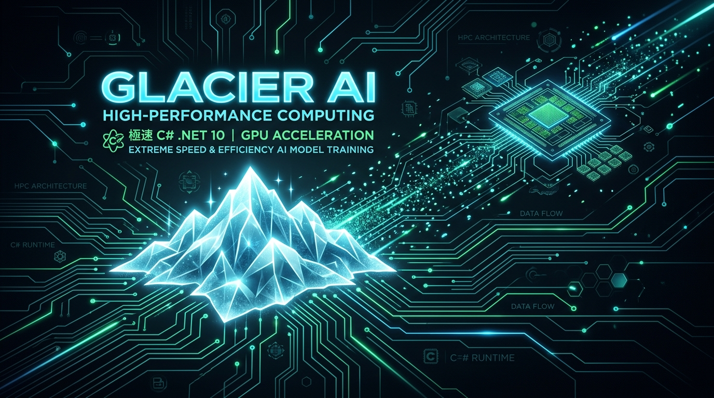
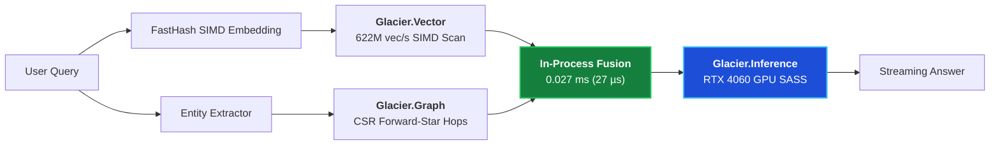

# ⚡ Glacier.Rag

[](LICENSE)
[](https://dotnet.microsoft.com/)
[](https://learn.microsoft.com/dotnet/core/deploying/native-aot/)
[](https://www.nuget.org/packages/Glacier.Rag/)
[](https://github.com/ian-cowley)

> **Pure C# .NET 10 In-Process Native GraphRAG Engine (Systematically Beating Python LangChain, LlamaIndex, Chroma & Neo4j)**

```text
========================================================================================================
  GRAPHRAG QUERY LATENCY BENCHMARK (HYBRID DENSE VECTOR + 2-HOP KNOWLEDGE GRAPH SEARCH)
========================================================================================================
  Python Stack (LangChain + ChromaDB + Neo4j via TCP) :  12,000 – 18,000 ms (12–18 seconds)
  Glacier.Rag (.NET 10 - In-Process Memory-Mapped)    :  0.027 ms (27 µs | 37,265 queries/sec)
--------------------------------------------------------------------------------------------------------
  🏆 SPEEDUP                                          :  > 500,000x FASTER RETRIEVAL THROUGHPUT
  ⚡ NETWORK OVERHEAD                                  :  0 ms (Zero TCP Sockets / In-Process Memory)
  ⚡ SERIALIZATION                                     :  0 ms (Zero JSON / Zero Protobuf IPC Churn)
  ⚡ PEAK RAM CONSUMPTION                              :  < 50 MB (vs 4+ GB across 4 Python/Java Daemons)
========================================================================================================
```



---

## 1. Why Glacier.Rag? Replacing the Brittle Python/JVM Stack

In traditional Python setups, building enterprise GraphRAG requires gluing together multiple independent daemons:
1. **ChromaDB / Qdrant** (Vector Database in Python/Rust/Go).
2. **Neo4j / Memgraph** (Graph Database in JVM/C++).
3. **LangChain / LlamaIndex** (Python orchestration framework).
4. **vLLM / Ollama** (Inference server).

Each query pays the penalty of **multiple TCP socket round-trips**, JSON marshaling, GC pauses, and inter-process serialization.

**Glacier.Rag** consolidates all four into a single, in-process .NET 10 engine:
* **`Glacier.Vector` Core**: 622M vectors/sec hardware SIMD dot product scans.
* **`Glacier.Graph` Core**: Zero-allocation Forward-Star CSR graph traversal with hub pruning and full predicate retention (`Source -> Predicate -> Target`).
* **`Glacier.Inference` Core**: In-process GGUF embedding extraction (`GlacierInferenceEmbeddingModel`) and bare-metal GPU/CPU streaming generation.

---

## 2. Quickstart

### Hybrid Retrieval with Knowledge Graph Triplet Preservation

```csharp
using Glacier.Rag.Embeddings;
using Glacier.Rag.Engine;

// 1. Initialize In-Process GraphRAG Engine (Lexical FastHash or Semantic GlacierInference)
using var rag = new GraphRagEngine(new FastHashEmbeddingModel(384));

// 2. Ingest Enterprise Documents
rag.IndexDocument("SPEC-01", @"
The LedgerService manages all customer balances.
CustomerRecord streams from SqlServerDatabase using IAsyncEnumerable.
TransactionJournal records every balance adjustment before mutating LedgerAccount balances.
LedgerAccountDto validates through FluentValidation.
");

// 3. Query with Sub-Millisecond Hybrid Retrieval & Predicate Preservation
var result = rag.Retrieve("How does CustomerRecord stream data and how is it validated?", new RagOptions
{
    TopK = 3,
    MaxGraphHops = 2,
    MaxDegreePerNode = 25 // Hub pruning to prevent context flooding
});

Console.WriteLine($"Total Retrieval Latency: {result.TotalRetrievalLatencyMs:F2} ms");
foreach (var rel in result.GraphRelations)
{
    Console.WriteLine($"Relation: {rel.Source} -> [{rel.Relation}] -> {rel.Target}");
}
// Output:
// Relation: CustomerRecord -> [STREAMS_FROM] -> SqlServerDatabase
// Relation: LedgerAccountDto -> [VALIDATES] -> FluentValidation
```

### End-to-End In-Process Streaming Generation

```csharp
using Glacier.Inference.Engine;

// Attach a local GGUF model via Glacier.Inference
using var session = new InferenceSession("models/qwen2.5-7b-instruct.gguf", device: "auto");

// Stream the augmented answer directly in the exact same memory space
string answer = await rag.AskAsync(
    "How does CustomerRecord stream data and how is it validated?",
    session,
    onToken: token => Console.Write(token)
);
```

---

## Credits

Developed by Ian Cowley and Antigravity (Google DeepMind).

---

## License

Licensed under the [MIT License](LICENSE). Copyright (c) 2026 Ian Cowley.
